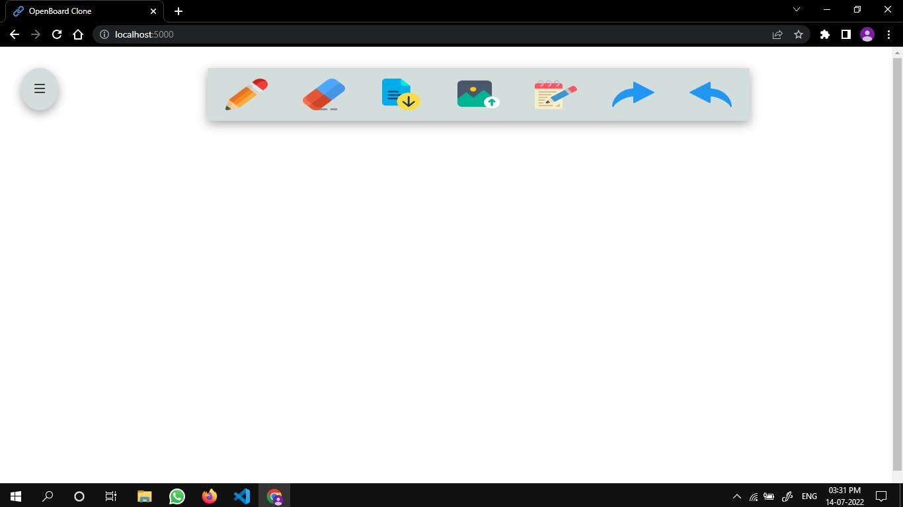

# Openboard_clone

This is Real time Openboard web application. In the application, you can perform draw, erase, undo/redo, sticky note, download board, etc.

# How to use

Important dependencies that need to be installed:
 
 - npm install express
 - npm install socket.io
 
Before proceeding, please check the version of node and npm you are running with:
 
 - node --version
 - npm --version
 
node version must be 17.1.0 or higher and npm version must be 8.13.0

---

How to run the website on local host:

 - Clone the project
 - node app.js
 - go to browser and type http://localhost:5000/
 

 
 
